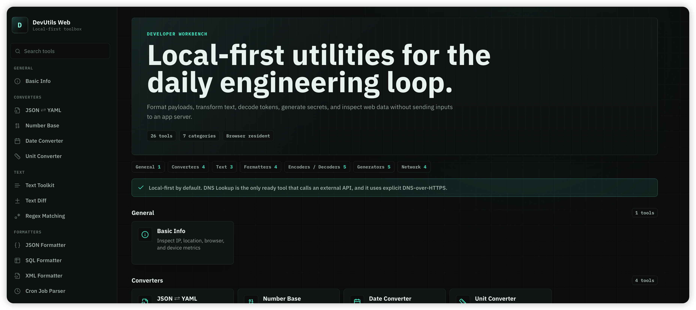
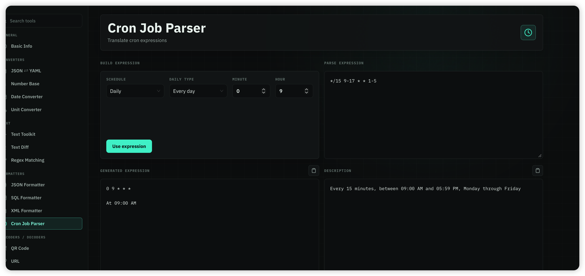
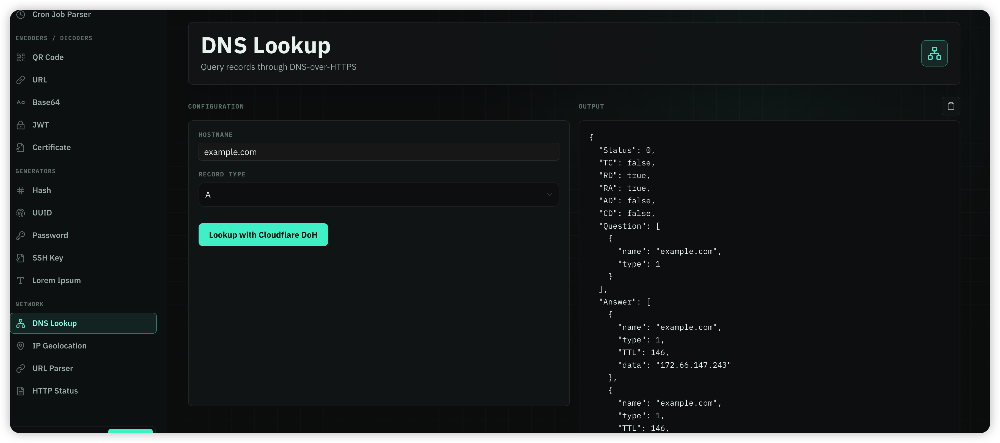
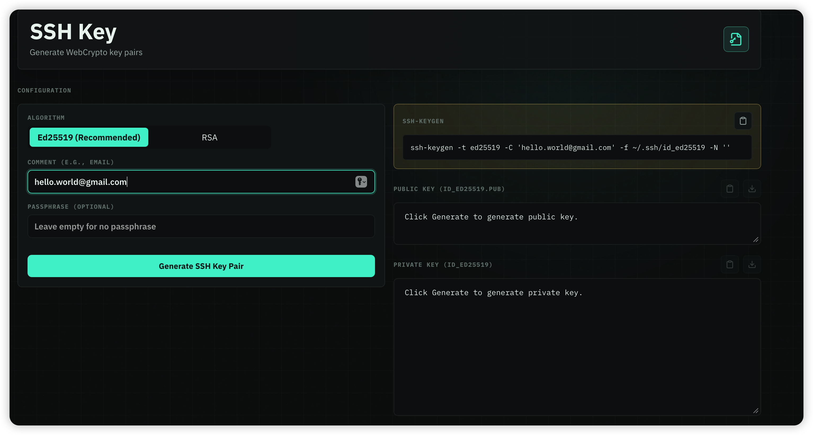

# 🛠️ DevUtils Web

[](https://vitejs.dev/)
[](https://reactjs.org/)
[](https://www.typescriptlang.org/)

A modern, fast, and local-first browser version of the **DevUtils macOS developer toolbox**. The app runs entirely in your browser, ensuring maximum privacy and offline capability! 🚀

---

## ✨ Features

- **Local-first & Secure**: Most tools run completely in the browser without sending your data anywhere!
- **Modern UI**: Clean and beautiful interface matching the macOS experience.
- **Lightning Fast**: Built with Vite + React + TypeScript.
- **Easy Deployment**: Designed out-of-the-box for GitHub Pages.

---

## 📸 Snapshots

### 🏠 Main Dashboard


### ⏱️ Cron Job Parser


### 🌐 DNS Lookup


### 🔑 SSH Key Generator


---

## 🚀 Getting Started

### Development

Clone the repository and install dependencies, then start the development server:

```bash
npm install
npm run dev
```

### Verification & Testing

Make sure tests pass before building the production version:

```bash
npm run test
npm run build
```

---

## 🔒 Privacy & Network

Most tools run **entirely in the browser**.  
*Note: The DNS Lookup tool uses explicit DNS-over-HTTPS requests.*
